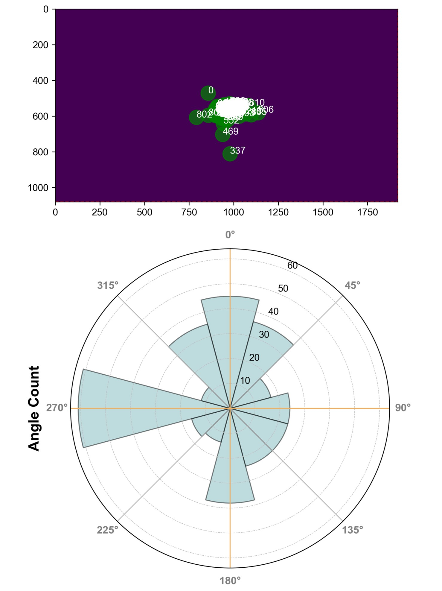

# Microsaccade and Auditory attention
### More coming up!
We are investigating the relationship between oculomotor activity, particularly, revealed by microsaccades and auditory speech attention.  

*Pilot data during attention to left*

