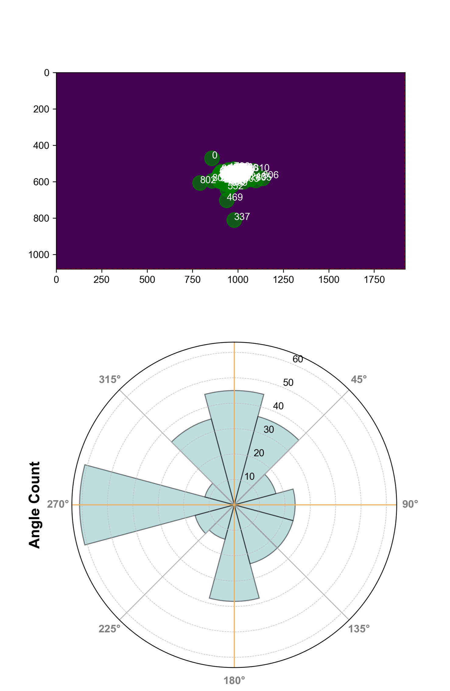

# Microsaccade and Auditory attention

We are investigating the relationship between oculomotor activity, particularly, revealed by microsaccades and auditory speech attention.
*Pilot data during attention to left*

